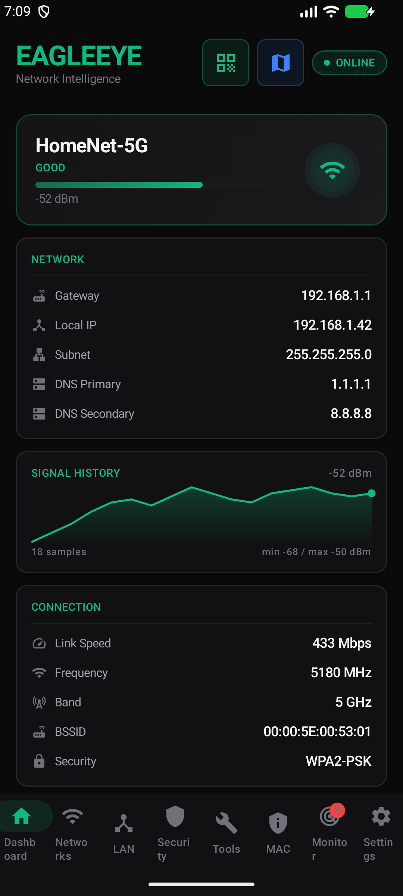
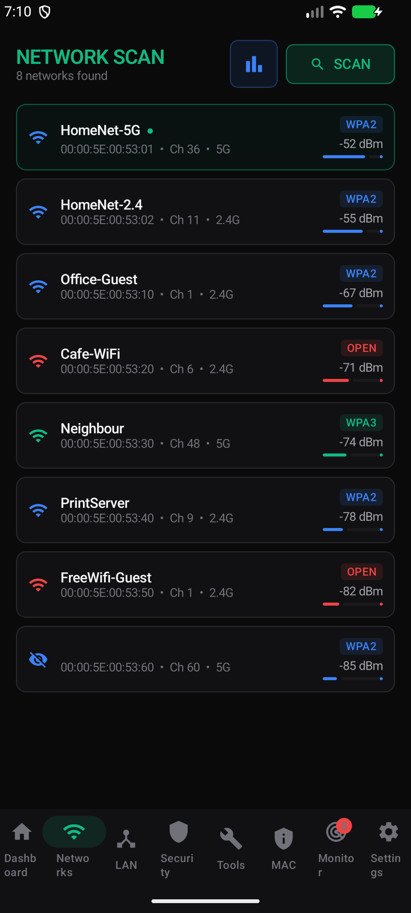
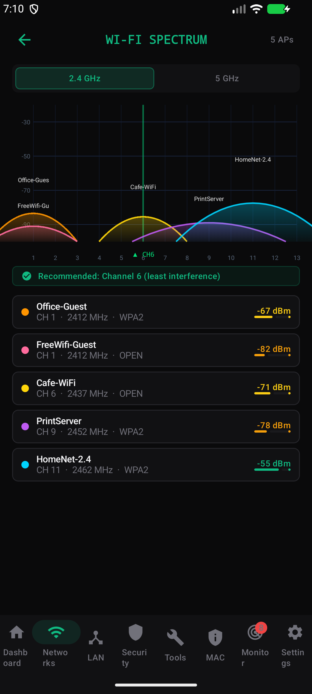
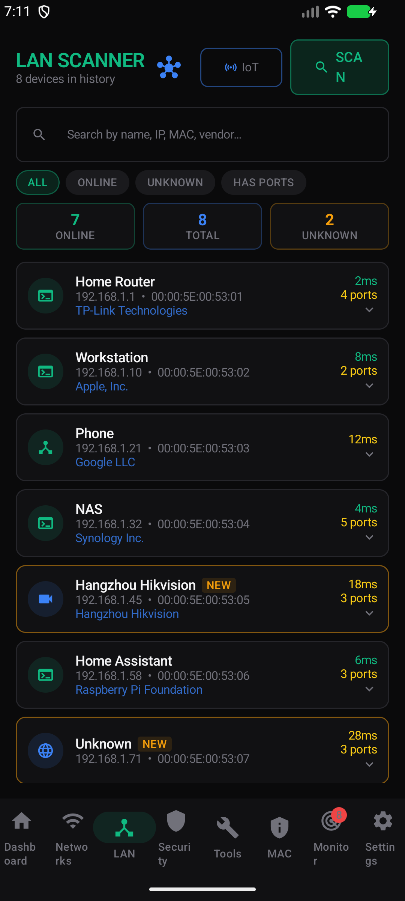
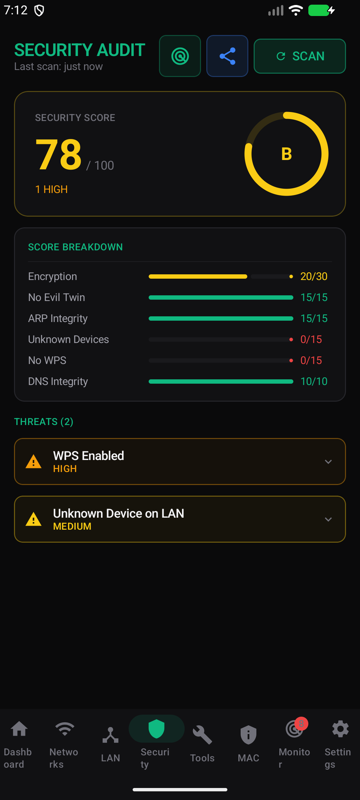
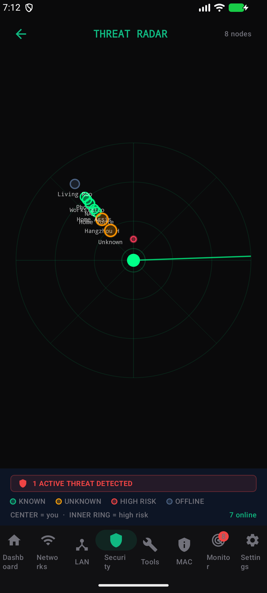
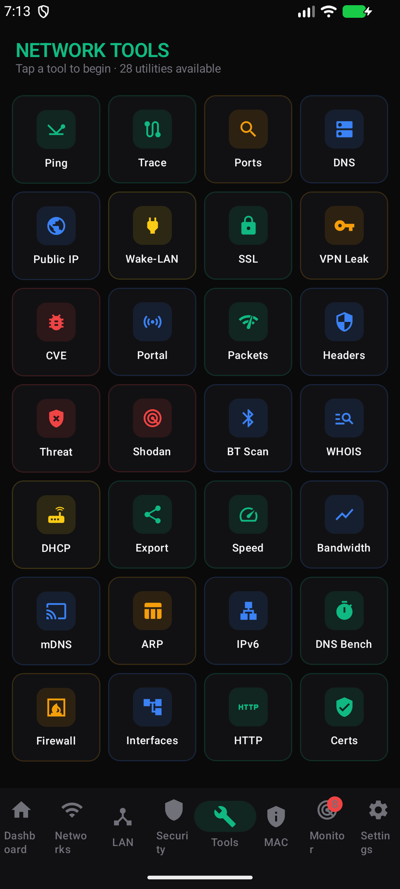
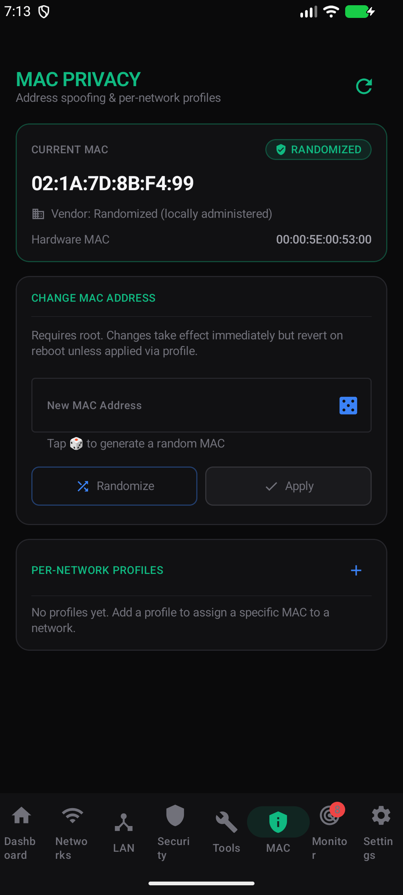
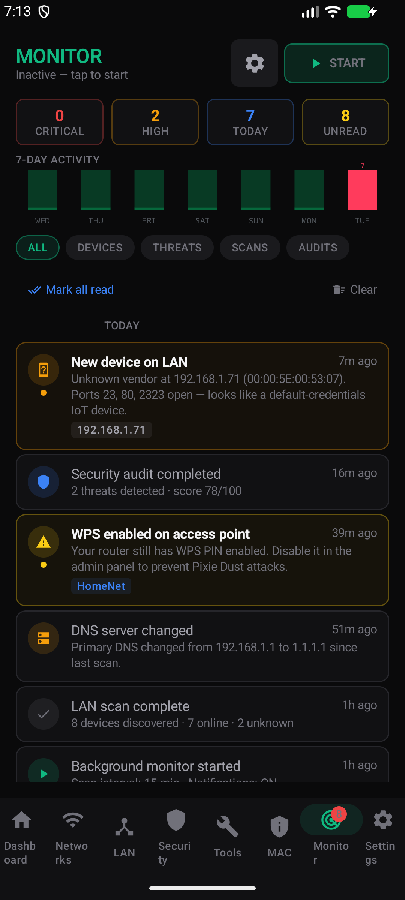
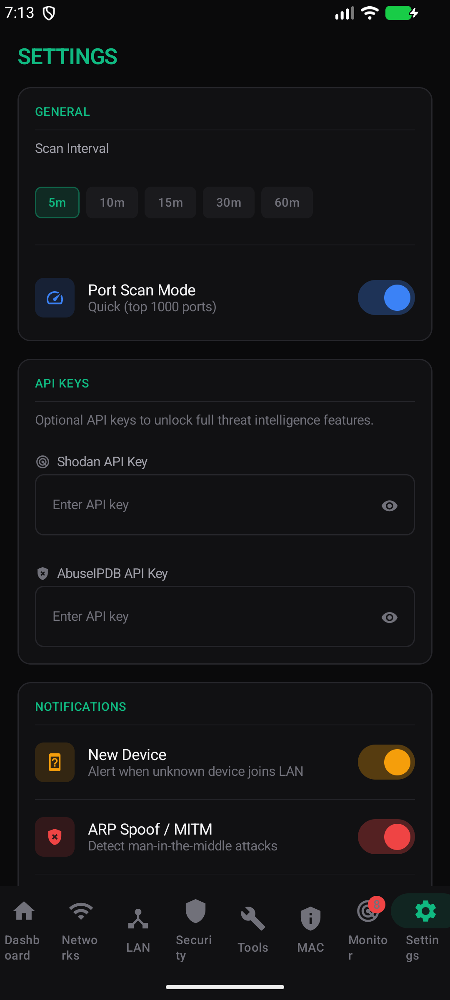

<div align="center">

# EagleEye

**Εργαλείο κυβερνοασφάλειας & ανάλυσης δικτύου για Android**

Single-Activity Jetpack Compose εφαρμογή που συγκεντρώνει 28 network tools, threat detection, LAN scanning και υπηρεσία παρακολούθησης παρασκηνίου σε μία στιλάτη επιφάνεια — γραμμένη σε ~16.000 γραμμές idiomatic Kotlin.

[](https://kotlinlang.org/)
[](https://developer.android.com/jetpack/compose)
[-3DDC84?logo=android&logoColor=white)](#)
[-3DDC84?logo=android&logoColor=white)](#)
[](#άδεια)

[English](README.md) · **[Ελληνικά](README.el.md)** · [User Guide](docs/USER_GUIDE.md)

</div>

---

## Πίνακας περιεχομένων

- [Συνοπτικά χαρακτηριστικά](#συνοπτικά-χαρακτηριστικά)
- [Screenshots](#screenshots)
- [Κατάλογος δυνατοτήτων](#κατάλογος-δυνατοτήτων)
- [Αρχιτεκτονική](#αρχιτεκτονική)
- [Δομή του project](#δομή-του-project)
- [Tech stack](#tech-stack-1)
- [Build & εγκατάσταση](#build--εγκατάσταση)
- [Testing](#testing)
- [Άδειες (permissions)](#άδειες-permissions)
- [Engineering notes](#engineering-notes)
- [Roadmap & γνωστοί περιορισμοί](#roadmap--γνωστοί-περιορισμοί)
- [Ιδιωτικότητα](#ιδιωτικότητα)
- [Νομικό πλαίσιο & εξουσιοδοτημένη χρήση](#νομικό-πλαίσιο--εξουσιοδοτημένη-χρήση)
- [Άδεια](#άδεια)

---

## Συνοπτικά χαρακτηριστικά

Το EagleEye είναι σκόπιμα opinionated security tool. Κάθε οθόνη είναι σχεδιασμένη γύρω από την ερώτηση *«τι πρέπει να βλέπει ένας αναλυτής μέσα στο πρώτο 1,5 δευτερόλεπτο;»*. Το αποτέλεσμα είναι πυκνό αλλά ευανάγνωστο: εξευγενισμένη σκούρα παλέτα εμπνευσμένη από Linear/Vercel/GitHub dashboards, ιεραρχία κειμένου με βάση το opacity, και Monospace γραμματοσειρά αυστηρά για δεδομένα (IPs, MACs, hex output).

- **28 network tools** σε ένα tab — ping, traceroute, port scanner, DNS lookup, WHOIS, SSL inspector, VPN leak test, αναζήτηση CVE, captive portal detector, HTTP security-headers analyzer, threat-intel lookup, Shodan, mDNS discovery, IPv6 inspector, DNS benchmark, firewall tester, speed test, bandwidth monitor, packet analyzer και άλλα.
- **Μηχανή εντοπισμού απειλών** — ARP-spoof / MITM, evil-twin (ίδιο SSID, ξένο BSSID), DNS hijack, rogue-DHCP scanner, weak-Wi-Fi audit (WEP/WPS/open), captive-portal analyzer με heuristics για phishing. Κάθε εύρημα κατατάσσεται ως `CRITICAL · HIGH · MEDIUM · LOW · INFO` και διατηρείται σε event log 7 ημερών.
- **LAN scanner** με παράλληλο ICMP sweep σε όλο το `/24`, OUI vendor lookup (ενσωματωμένη Wireshark OUI database με 41.000 εγγραφές), service fingerprinting σε 16 κοινά ports, alias και «known» flag ανά συσκευή, καθώς και ARP fallback για Android 11+ ώστε ο εντοπισμός να δουλεύει ακόμα κι όταν το `/proc/net/arp` είναι περιορισμένο.
- **Παρακολούθηση παρασκηνίου** ως υπηρεσία `FOREGROUND_SERVICE_TYPE_CONNECTED_DEVICE` με σωστή σημασιολογία για Android 14+. Επαναλαμβανόμενες σαρώσεις κάθε Ν λεπτά, widget στην αρχική οθόνη με την τρέχουσα βαθμολογία ασφαλείας, persistent notifications με προτεραιότητα ανάλογη της σοβαρότητας.
- **Packet analyzer** που καταγράφει live κίνηση της συσκευής μέσω `VpnService` (χωρίς root) — κάνει parse IPv4/TCP/UDP/ICMP headers, εξάγει DNS queries, αθροίζει top destinations, με σκληρά πλαφόν μνήμης για μακροχρόνιες συνεδρίες.
- **Εργαλεία MAC privacy** — εντοπισμός randomized MAC (locally-administered bit), αλλαγή MAC με root μέσω `ip link`, profiles ανά SSID με διαστήματα auto-rotation, ανάκτηση hardware MAC.
- **Σύγχρονη αρχιτεκτονική** — single-Activity Compose UI, sealed `Screen` routing με `AnimatedContent` crossfade, MVVM με `StateFlow`, Room (3 entities), settings σε DataStore, `viewModelScope` + structured concurrency παντού.

> **Γιατί «EagleEye»;** Το μάτι του αετού βλέπει αυτό που κρύβει το δίκτυο — παθητική παρατήρηση, καμία επιθετική κίνηση δεν παράγεται.

---

## Screenshots

Όλα τα screenshots παρακάτω τραβήχτηκαν με ενεργοποιημένο το `Demo Mode` (toggle στο **Settings → DEMO MODE**), ώστε να δείχνουν ρεαλιστικά δεδομένα χωρίς να αποκαλύπτουν κανένα πραγματικό δίκτυο. Όλα τα MACs χρησιμοποιούν το IETF-reserved prefix `00:00:5E:*`, όλα τα SSIDs και ονόματα συσκευών είναι επινοημένα.

<table>
  <tr>
    <td align="center"><br/><sub><b>Dashboard</b><br/>τρέχουσα σύνδεση, signal history, λεπτομέρειες</sub></td>
    <td align="center"><br/><sub><b>Network Scan</b><br/>γειτονικά APs, σήμα, κανάλι, security grade</sub></td>
    <td align="center"><br/><sub><b>Wi-Fi Spectrum</b><br/>κατάληψη 2.4 / 5 GHz + recommendation</sub></td>
  </tr>
  <tr>
    <td align="center"><br/><sub><b>LAN Scanner</b><br/>συσκευές, vendor, open ports, known/unknown</sub></td>
    <td align="center"><br/><sub><b>Security Audit</b><br/>score 0–100 με grade + breakdown + threats</sub></td>
    <td align="center"><br/><sub><b>Threat Radar</b><br/>animated sonar sweep, συσκευές ταξινομημένες κατά risk</sub></td>
  </tr>
  <tr>
    <td align="center"><br/><sub><b>Network Tools</b><br/>grid 28 εργαλείων (ping, traceroute, port scan, …)</sub></td>
    <td align="center"><br/><sub><b>MAC Privacy</b><br/>κατάσταση randomization + per-network profiles</sub></td>
    <td align="center"><br/><sub><b>Monitor</b><br/>event log background scan + 7-day activity</sub></td>
  </tr>
  <tr>
    <td></td>
    <td align="center"><br/><sub><b>Settings</b><br/>scan interval, API keys, notifications, demo mode</sub></td>
    <td></td>
  </tr>
</table>

---

## Κατάλογος δυνατοτήτων

### Wi-Fi & σύνδεση

- Live στοιχεία σύνδεσης (SSID, BSSID, IP, gateway, subnet, DNS×2, link speed, RSSI, band, security type)
- Σαρωτής δικτύων με security grade ανά AP, σήμανση hidden-SSID, ταξινόμηση ανά RSSI
- Signal history strip chart (sliding window 60 δειγμάτων)
- Wi-Fi QR generator (WIFI:T:WPA2;S:…;P:…;;)
- Spectrum visualizer (χρήση καναλιών)

### LAN intelligence

- Παράλληλο ping sweep σε όλο το `/24` (254 hosts σε ~2 s)
- ARP-based ανάλυση MAC με Android-11+ ping-sweep fallback
- OUI vendor lookup (Wireshark database μέσα στα assets)
- Service fingerprinting σε 16 ports (HTTP/HTTPS/SSH/FTP/SMB/RTSP/RDP/VNC/…)
- Σήμανση known/unknown ανά συσκευή, alias, latency, first/last seen
- Topology view (force-directed graph) και device action menu (ping, copy, mark known)
- Snapshots σάρωσης (τα τελευταία 5) με deltas νέων συσκευών

### Security audit & εντοπισμός απειλών

- Evil-twin AP detection — ίδιο SSID, ξένο BSSID
- ARP MITM detection — αλλαγή IP→MAC σε σχέση με baseline + multi-IP-same-MAC σύγκρουση
- DNS hijack detection — αλλαγή primary DNS σε σχέση με αποθηκευμένο baseline
- Rogue DHCP scanner — εντοπίζει DHCP offers από μη-router συσκευές στο LAN
- Έλεγχος weak Wi-Fi — γείτονες WEP, open, WPS-enabled
- Captive portal analyzer — HTTP/HTTPS probe + heuristics για phishing-form
- Βαθμολογία ασφαλείας ανά δίκτυο (0–100, βαθμός A→F) που τροφοδοτεί το widget

### Network tools (το tab Tools, 28 εργαλεία)

`Ping` · `Traceroute` · `Port scanner` · `DNS lookup` · `Public IP` · `Wake-on-LAN` · `SSL inspector` · `VPN leak test` · `CVE search` · `Captive portal` · `HTTP-headers analyzer` · `Threat intelligence` (ip-api + AbuseIPDB) · `Shodan` (free InternetDB tier) · `Bluetooth scan` (Classic + BLE) · `WHOIS` · `Rogue DHCP` · `Export` (JSON + text) · `Speed test` · `Bandwidth monitor` · `mDNS discovery` · `ARP cache` · `IPv6 inspector` · `DNS benchmark` (συγκρίνει public resolvers) · `Firewall tester` · `Network interfaces` · `HTTP client` · `Αναζήτηση Certificate transparency log` · `Packet analyzer` (VpnService)

### Privacy & MAC

- Τρέχον MAC + ανίχνευση randomization bit
- Αλλαγή MAC με root μέσω `ip link set <iface> address …`
- MAC profiles ανά SSID + διάστημα auto-rotation (ώρες)
- Vendor lookup για το ενεργό MAC

### Παρασκήνιο & widgets

- Foreground service με ρυθμιζόμενο διάστημα και toggles ανά τύπο απειλής
- Threat notifications με προτεραιότητα ανάλογη της σοβαρότητας
- Widget αρχικής οθόνης με τρέχοντα security grade, αριθμό απειλών, timestamp τελευταίας σάρωσης
- Rolling event log 7 ημερών αποθηκευμένο στο Room

### Export & μοιρασμός

- JSON ή text αναφορές του τρέχοντος audit + ιστορικού γεγονότων
- Share intent μέσω file-provider
- Όλες οι εξαγωγές περιλαμβάνουν metadata της συσκευής και timestamp

---

## Αρχιτεκτονική

```
┌─────────────────────────────────────────────────────────────────┐
│                       MainActivity (single)                     │
│  ┌─────────────────────────────────────────────────────────┐    │
│  │  Compose UI — sealed Screen routing + AnimatedContent   │    │
│  │  Dashboard · Networks · LAN · Security · Tools          │    │
│  │  MAC · Monitor · Settings                               │    │
│  └─────────────────────────────────────────────────────────┘    │
│              │                          │                       │
│   ┌──────────▼──────────┐    ┌──────────▼──────────┐            │
│   │  ViewModels (10)    │    │  Services (2)       │            │
│   │  StateFlow exposed  │    │  MonitorService     │            │
│   │  viewModelScope     │    │  PacketCaptureSvc   │            │
│   └──────────┬──────────┘    └──────────┬──────────┘            │
│              │                          │                       │
│   ┌──────────▼──────────────────────────▼──────────┐            │
│   │              Repositories / Engines            │            │
│   │  WifiRepo · LanRepo · MacRepo · ThreatDetector │            │
│   │  MonitorEngine · NetworkTools · IoTProfiler    │            │
│   └──────────┬───────────────┬────────────────┬────┘            │
│              │               │                │                 │
│      ┌───────▼─────┐  ┌──────▼─────┐  ┌──────▼─────┐            │
│      │  Room DB    │  │  DataStore │  │   System   │            │
│      │  (3 tables) │  │   Settings │  │    APIs    │            │
│      └─────────────┘  └────────────┘  └────────────┘            │
└─────────────────────────────────────────────────────────────────┘
```

**Μοντέλο threading.** Κάθε μακρά κλήση ζει σε `Dispatchers.IO` μέσω `viewModelScope.launch(Dispatchers.IO)` ή `withContext(Dispatchers.IO)`. Τα hot data εκτίθενται ως `StateFlow` ώστε το Compose να τα `collectAsState()` χωρίς leaks. Οι services χρησιμοποιούν ιδιωτικό `CoroutineScope(SupervisorJob() + Dispatchers.IO)` που ακυρώνεται στο `onDestroy()`.

**Persistence.** Τρία Room entities — `LanDevice`, `MacProfile`, `NetworkEvent` — με observable DAOs (`Flow<List<…>>`). Τα settings ζουν σε `DataStore Preferences` για ατομικές ενημερώσεις χωρίς race conditions. Το schema χρησιμοποιεί `fallbackToDestructiveMigration` γιατί η εφαρμογή είναι pre-1.0· σε production θα προστεθεί `Migration` list.

**Single Activity.** Χωρίς `Fragment`, χωρίς βιβλιοθήκη navigation — το Compose είναι η επιφάνεια navigation. Η τρέχουσα οθόνη είναι ένα `sealed Screen` αποθηκευμένο με `rememberSaveable(stateSaver = …)` ώστε να επιβιώνει σε rotation και process death. Το `AnimatedContent` δίνει crossfade 220 ms μεταξύ tabs.

---

## Δομή του project

```
app/src/main/java/com/eagleeye/
├── MainActivity.kt                  Σημείο εισόδου — sealed Screen routing, NavigationBar, AnimatedContent
│
├── data/                            Immutable domain models + Room schema
│   ├── WifiData.kt                  ScannedNetwork, WifiConnectionInfo, SignalSample, …
│   ├── LanDevice.kt                 LAN scan result entity + DAO model
│   ├── SecurityData.kt              Threat, ThreatLevel, SecurityScore, ArpEntry
│   ├── MonitorData.kt               EventType, EventSeverity, NetworkEvent, MonitorConfig
│   ├── ToolsData.kt                 28 τύποι αποτελεσμάτων — PingResult, WhoisResult, ShodanResult, …
│   ├── PacketData.kt                CapturedPacket, IpProtocol, PacketStats
│   └── db/                          Room: AppDatabase + 3 DAOs
│
├── modules/                         Feature modules, αυτοτελή
│   ├── wifi/                        WifiRepository + WifiViewModel + WifiQrGenerator
│   ├── lan/                         LanRepository + OuiLookup + LanViewModel
│   ├── security/                    ThreatDetector + SecurityViewModel + RogueDhcpDetector
│   ├── monitor/                     MonitorService + MonitorEngine + NotificationHelper
│   ├── packet/                      PacketCaptureService + PacketParser + PacketViewModel
│   ├── tools/                       28 ξεχωριστά tool clients + ToolsViewModel
│   ├── mac/                         MacRepository + MacViewModel (root μέσω `su`)
│   ├── iot/                         IoTProfiler + SsdpScanner
│   ├── bluetooth/                   BluetoothViewModel (Classic + BLE scanner)
│   ├── cve/                         NVD CVE lookup client
│   ├── export/                      ReportExporter (JSON + text)
│   ├── portal/                      CaptivePortalDetector
│   └── settings/                    SettingsRepository (DataStore)
│
├── ui/
│   ├── screens/                     Μία Composable ανά top-level screen
│   │   ├── DashboardScreen.kt       Hero card, signal history, στοιχεία δικτύου
│   │   ├── NetworkScanScreen.kt     Κοντινά δίκτυα με security grading
│   │   ├── LanScannerScreen.kt     Λίστα συσκευών, αναζήτηση, φίλτρα, ιστορικό
│   │   ├── SecurityScreen.kt        Audit αποτέλεσμα, λίστα απειλών
│   │   ├── ToolsScreen.kt           Tool grid + 28 ξεχωριστά tool composables
│   │   ├── MacScreen.kt             Στοιχεία MAC + profiles
│   │   ├── MonitorScreen.kt         Παρακολούθηση παρασκηνίου + event log
│   │   ├── SettingsScreen.kt        Settings βασισμένα σε DataStore
│   │   ├── OnboardingScreen.kt      Πρώτη εκτέλεση — αιτιολόγηση permissions
│   │   ├── TopologyScreen.kt        Force-directed γράφος LAN
│   │   ├── SpectrumScreen.kt        Χρήση καναλιών Wi-Fi
│   │   ├── GeoMapScreen.kt          GeoIP map πρόσφατων προορισμών
│   │   ├── ThreatRadarScreen.kt     Radial επισκόπηση απειλών
│   │   ├── PacketAnalyzerScreen.kt  UI για VpnService
│   │   └── PlaceholderScreens.kt    Empty / loading states
│   └── theme/
│       ├── Color.kt                 Εξευγενισμένη σκούρα παλέτα (emerald/blue/red/amber σε near-black)
│       ├── Type.kt                  System sans για UI, Monospace μόνο για δεδομένα
│       └── Theme.kt                 Material 3 dark color scheme
│
└── widget/                          Widget αρχικής οθόνης με security grade
    ├── SecurityWidget.kt
    └── SecurityWidgetReceiver.kt

app/src/test/java/com/eagleeye/       JVM unit tests (τρέχουν με `./gradlew test`)
├── modules/packet/PacketParserTest.kt    8 tests — IPv4/TCP/UDP/ICMP/DNS parser
├── modules/security/DnsAnalysisTest.kt  14 tests — DNS helpers + evil-twin detection
├── modules/lan/OuiLookupTest.kt          8 tests — MAC prefix matching (24/28/36-bit)
└── modules/tools/PortServiceNameTest.kt  8 tests — well-known port → service mapping
```

---

## Tech stack

| Layer | Επιλογή | Σημειώσεις |
|-------|---------|------------|
| Γλώσσα | Kotlin 2.0 | Coroutines + Flow, καθόλου Java σε production κώδικα |
| UI | Jetpack Compose (Material 3) | Compose BOM 2024.11, material-icons-extended, χωρίς navigation-compose (γίνεται με sealed-class routing) |
| Αρχιτεκτονική | Single-Activity MVVM | Sealed `Screen`, `StateFlow`, `viewModelScope` |
| Persistence | Room 2.6 + DataStore Preferences 1.1 | 3 tables, observable DAOs, ατομικές ενημερώσεις settings |
| Παρασκήνιο | Foreground `Service` (FGS) | Τύπος `connectedDevice` για σημασιολογία Android 14+ |
| Packet capture | `VpnService` | Χωρίς root — το system δρομολογεί την κίνηση μέσω VPN routing |
| Concurrency | Coroutines 1.9 | `Dispatchers.IO` για κάθε network operation, `SupervisorJob()` στις services |
| QR / Bitmap | ZXing core 3.5 | Wi-Fi QR codes |
| Build | Gradle 8.7 + AGP 8.4 + Kotlin 2.0 | Version catalog, kapt για Room compiler |
| Testing | JUnit 4 + kotlinx-coroutines-test | JVM unit tests, χωρίς instrumented tests ακόμα |

---

## Build & εγκατάσταση

```bash
# Debug APK
ANDROID_HOME=$ANDROID_HOME ./gradlew assembleDebug

# Εγκατάσταση σε συνδεδεμένη συσκευή ή emulator
ANDROID_HOME=$ANDROID_HOME ./gradlew installDebug

# Signed release APK (χρειάζεται keystore στο app/build.gradle.kts)
ANDROID_HOME=$ANDROID_HOME ./gradlew assembleRelease

# Clean
./gradlew clean
```

**Απαιτήσεις**
- JDK 17
- Android SDK με API 35
- Min device: Android 8.0 (API 26)
- Κάποια προχωρημένα features (αλλαγή MAC, deauth detection) απαιτούν **root**

**Output:** `app/build/outputs/apk/debug/app-debug.apk` (~20.7 MB debug, περιλαμβάνει την OUI database)

---

## Testing

```bash
# JVM unit tests (γρήγορα — χωρίς emulator)
./gradlew testDebugUnitTest

# Lint
./gradlew lintDebug
```

**Τρέχον test coverage** — 38 JVM unit tests, όλα πράσινα:

- `PacketParserTest` — 8 tests που καλύπτουν απόρριψη μη-IPv4 πακέτων, TCP/UDP/ICMP parsing, εξαγωγή DNS query name, truncated buffers, OTHER protocol fallback, size clamping. Hand-crafted byte arrays δοκιμάζουν τον parser χωρίς πραγματικά πακέτα.
- `DnsAnalysisTest` — 14 tests που καλύπτουν little-endian `DhcpInfo` IP decoding, ταξινόμηση RFC1918 private ranges, αναγνώριση well-known resolvers (Google/Cloudflare/Quad9/OpenDNS) και case-insensitive multi-rogue evil-twin detection.
- `OuiLookupTest` — 8 tests που καλύπτουν 24/28/36-bit prefix matching, longest-prefix-wins, case-insensitive και dash-separated MAC notation, fallback αλυσίδα MA-S → MA-M → OUI.
- `PortServiceNameTest` — 8 tests που καλύπτουν well-known port mappings (HTTP/HTTPS/SSH/RDP/SMTP/IMAP/databases/Metasploit) και το `Port N` fallback για άγνωστα ports.

Τα pure helpers (DNS classification, OUI prefix matching, port lookup, evil-twin filtering) έχουν εξαχθεί σκόπιμα ως top-level functions στα αντίστοιχα module αρχεία τους, ώστε να είναι unit-testable στο JVM χωρίς emulator ή `Context`.

**Υγεία lint:** `0 errors, 52 warnings` (warnings είναι deprecated `WifiInfo.SSID`, διαθέσιμα AGP/library bumps, και μερικά always-true lint heuristics — κανένα λειτουργικό).

---

## Άδειες (permissions)

| Άδεια | Σκοπός | Runtime; |
|------------|---------|----------|
| `ACCESS_WIFI_STATE` | Ανάγνωση Wi-Fi connection metadata | install-time |
| `CHANGE_WIFI_STATE` | Trigger σάρωσης μέσω `WifiManager.startScan()` | install-time |
| `ACCESS_FINE_LOCATION` | Απαιτείται από Android για παραλαβή scan results από API 28 | **runtime** |
| `ACCESS_COARSE_LOCATION` | Συμπληρωματικό του fine location | runtime |
| `ACCESS_NETWORK_STATE` | Ανίχνευση αλλαγών συνδεσιμότητας μέσω `ConnectivityManager` | install-time |
| `INTERNET` | CVE lookup, ip-api GeoIP, Shodan InternetDB, public IP, captive-portal probes | install-time |
| `CHANGE_NETWORK_STATE` | Χρησιμοποιείται από Wake-on-LAN και VPN service | install-time |
| `CHANGE_WIFI_MULTICAST_STATE` | mDNS / Bonjour discovery | install-time |
| `FOREGROUND_SERVICE` | Lifecycle του MonitorService | install-time |
| `FOREGROUND_SERVICE_CONNECTED_DEVICE` | Τύπος FGS που απαιτείται από Android 14+ | install-time |
| `FOREGROUND_SERVICE_DATA_SYNC` | Legacy FGS υποστήριξη pre-Android 14 | install-time |
| `POST_NOTIFICATIONS` | Threat alerts σε Android 13+ | runtime |
| `BLUETOOTH_SCAN` / `BLUETOOTH_CONNECT` | BT scanner σε Android 12+ | runtime |
| `BLUETOOTH` / `BLUETOOTH_ADMIN` | Pre-Android-12 fallback | install-time |
| `RECEIVE_BOOT_COMPLETED` | Auto-restart του monitor μετά από reboot | install-time |

**Η εφαρμογή καλεί το `RequestMultiplePermissions` μόνο για το missing subset** — όσα έχουν δοθεί δεν ζητιούνται ξανά.

---

## Engineering notes

Λίγες αποφάσεις που αξίζει να αναφερθούν:

- **Περιορισμός ARP σε Android 11+.** Το `/proc/net/arp` ξεκίνησε να επιστρέφει μηδενισμένα MACs από API 30. Το EagleEye εντοπίζει το κενό cache και κάνει fallback σε παράλληλο ICMP ping sweep πάνω στο `/24`. Η ανίχνευση νέων συσκευών εξακολουθεί να δουλεύει (το IP γίνεται κλειδί)· οι έλεγχοι ARP-spoof και MAC-conflict υποβαθμίζονται χαριτωμένα με ένα one-time `INFO` event ώστε ο χρήστης να ξέρει ότι η παρακολούθηση είναι περιορισμένη.

- **VpnService για packet capture.** Αποφεύγει το root εντελώς — το σύστημα δρομολογεί όλη την κίνηση μέσω του δικού μας VPN interface, εμείς διαβάζουμε πακέτα από `ParcelFileDescriptor`, parse και drop. Το Internet παγώνει για τη συσκευή όσο το capture είναι ενεργό (αναφέρεται μέσα στην οθόνη).

- **Υγιεινή foreground-service.** Το `MonitorService` χρησιμοποιεί `FOREGROUND_SERVICE_TYPE_CONNECTED_DEVICE` για να αποφύγει το όριο 6 ωρών/ημέρα στις `dataSync` services σε Android 14+. Το `PacketCaptureService` καλεί το `startForeground()` *πριν* το `Builder.establish()` γιατί διαφορετικά το Android 12+ πετάει `ForegroundServiceStartNotAllowedException`.

- **Παγίδα SecurityException στο `scanResults`.** Κάθε κλήση στο `WifiManager.scanResults` τυλίγεται σε `try { … } catch (SecurityException) { null }` γιατί η άδεια μπορεί να ανακληθεί ενώ η εφαρμογή τρέχει — έξι σημεία κλήσης κρασάριζαν πριν τη διόρθωση.

- **Πλαφόν μνήμης στον packet analyzer.** Τα `dnsQuerySet` και `destCounts` έχουν όρια (200 / 1000 entries με FIFO eviction ή top-N retention) ώστε μεγάλες συνεδρίες capture να μη γεμίζουν τη μνήμη.

- **Επιβίωση state.** Το top-level `Screen` είναι `rememberSaveable` με `Saver<Screen, String>` ώστε το ενεργό tab να επιβιώνει rotation και process death.

- **Εξευγενισμένη παλέτα αντί νέον.** Τα ονόματα `Cyber*` από την αρχική cyberpunk παλέτα διατηρούνται για σταθερότητα του codebase, αλλά οι *τιμές* μετακινήθηκαν σε Tailwind 500-tier αποχρώσεις (emerald, blue, red, amber) πάνω σε near-black layered surface hierarchy — διαβάζεται σαν επαγγελματικό dashboard αντί για τερματικό του 1990.

---

## Roadmap & γνωστοί περιορισμοί

**Περιορισμοί της τρέχουσας πλατφόρμας**

- Η ARP-based ανίχνευση είναι υποβαθμισμένη σε Android 11+ (kernel restriction, μη διορθώσιμο σε user space χωρίς root).
- Η αλλαγή randomized MAC χρειάζεται root (`ip link set wlan0 address …`).
- Η ανίχνευση deauth attack απαιτεί monitor-mode Wi-Fi, μη διαθέσιμο σε stock Android.
- Ο packet analyzer δρομολογεί κίνηση μέσω `VpnService` — βλέπει μόνο **την κίνηση αυτής της συσκευής**, όχι όλο το LAN.

**Πιθανά επόμενα βήματα**

- Μεταφορά του 800-line user guide σε docs site (MkDocs / Docusaurus).
- Instrumented Compose UI tests.
- AGP 9.x + Compose BOM bump (τώρα AGP 8.4.2 με `compileSdk = 35` βγάζει warning).
- Συγκέντρωση όλων των hardcoded port→service mappings σε μία κοινή σταθερά.
- Προαιρετική εξαγωγή `.pcap` σε Wireshark format από τον packet analyzer.

---

## Ιδιωτικότητα

Το EagleEye χτίστηκε με αρχές **local-first, no-telemetry**. Συγκεκριμένα:

- **Καμία analytics, κανένα crash reporting, καμία telemetry προς τον developer.** Η εφαρμογή δεν στέλνει τίποτα πίσω.
- **Όλα τα scan data αποθηκεύονται τοπικά** στην on-device Room database (`lan_devices`, `network_events`, `mac_profiles`). Τίποτα δεν ανεβαίνει.
- **Τα captured πακέτα δεν φεύγουν ποτέ από τη συσκευή.** Ο `VpnService`-based packet analyzer τα κρατάει in-memory και τα πετάει όταν σταματάς το capture.
- **Third-party endpoints που καλεί η εφαρμογή** (πάντα μέσω HTTPS και μόνο όταν το τρέχεις εσύ ρητά):

  | Tool | Endpoint | Τι στέλνεται | Σκοπός |
  |------|----------|--------------|--------|
  | Public IP | `api.ipify.org`, `ifconfig.me`, `ip-api.com` | Η public IP σου | Εμφάνιση egress IP + GeoIP |
  | Captive portal | Τα standard Android captive-portal probe URLs | Ένα probe HTTP request | Detection captive portal |
  | Threat Intel | `abuseipdb.com` (μόνο αν βάλεις δικό σου API key) | Η IP που ρώτησες | Reputation lookup |
  | Shodan | `api.shodan.io` (μόνο αν βάλεις δικό σου API key) | Η IP που ρώτησες | Open-port intel |
  | Cert Transparency | `crt.sh` | Το domain που ρώτησες | Δημόσιο CT-log lookup |
  | CVE | `services.nvd.nist.gov` | Το CPE/keyword που ρώτησες | Δημόσιο NVD lookup |

  Κάθε external call ξεκινάει μόνο μετά από ρητή ενέργειά σου, ποτέ στο background.

- **Τα API keys** (Shodan, AbuseIPDB) αποθηκεύονται στο DataStore Preferences της συσκευής και δεν διαβιβάζονται πουθενά εκτός από τους ίδιους τους providers τους.
- **MAC addresses και SSIDs** γειτονικών συσκευών/δικτύων μπορεί να θεωρούνται προσωπικά δεδομένα κατά GDPR. Το EagleEye τα χειρίζεται αναλόγως: τοπικά μόνο, ποτέ δεν μοιράζονται, και είναι αφαιρέσιμα μέσω Settings → "Clear scan history".

Αν κάνεις fork το EagleEye και προσθέσεις οποιοδήποτε upload, telemetry ή remote logging, γίνεσαι data controller κατά GDPR και πρέπει να δημοσιεύσεις δική σου privacy notice.

---

## Νομικό πλαίσιο & εξουσιοδοτημένη χρήση

**Το EagleEye είναι defensive security & network-analysis tool. Χρησιμοποίησέ το μόνο σε δίκτυα που σου ανήκουν ή για τα οποία έχεις ρητή, γραπτή εξουσιοδότηση audit.**

Το ίδιο το εργαλείο ανήκει στην ίδια κατηγορία με Wireshark, Nmap, Fing και άλλα παρόμοια open-source utilities — όλα τα features του είναι αυστηρά passive / detection-oriented:

- Το Wi-Fi scanning βασίζεται σε δημόσια SSID/BSSID broadcasts (νόμιμη λήψη).
- Το LAN scanning δουλεύει μόνο στο δίκτυο όπου είναι ήδη συνδεδεμένη η συσκευή.
- Το packet capture χρησιμοποιεί το `VpnService` του Android και βλέπει **μόνο την κίνηση αυτής της συσκευής** (το OS δρομολογεί μόνο το local app/device μέσω του VPN).
- Τα "ARP spoofing" και "evil twin" features είναι **detection only** — το EagleEye δεν εκτελεί ποτέ επίθεση, μόνο αναφέρει anomalies σε cached state.
- Δεν υλοποιείται password cracking, WPS-PIN attack, deauth injection, ή δημιουργία evil-twin AP.

Μη εξουσιοδοτημένη σάρωση, παρακολούθηση ή ανάλυση δικτύων/συσκευών που δεν σου ανήκουν μπορεί παρ' όλα αυτά να παραβιάζει την ισχύουσα νομοθεσία, συμπεριλαμβανομένων ενδεικτικά:

- **Ελληνικό δίκαιο**: Άρθρο 370Β / 370Γ Ποινικού Κώδικα (παράνομη πρόσβαση σε σύστημα πληροφοριών, παραβίαση δεδομένων προσωπικού χαρακτήρα), N. 3471/2006 (απόρρητο ηλεκτρονικών επικοινωνιών), N. 4624/2019 (εφαρμογή GDPR)
- **Ευρωπαϊκό δίκαιο**: GDPR (Κανονισμός 2016/679), ePrivacy Directive (2002/58/EΚ), NIS2 Directive (2022/2555)
- **Διεθνές**: Σύμβαση της Βουδαπέστης για το Cybercrime (2001)
- **U.S. δικαιοδοσίες**: Computer Fraud and Abuse Act (18 U.S.C. § 1030)
- Αντίστοιχες διατάξεις σε άλλες δικαιοδοσίες

Εγκαθιστώντας ή τρέχοντας το EagleEye αναλαμβάνεις πλήρως την ευθύνη να διασφαλίσεις ότι η χρήση σου συμμορφώνεται με την ισχύουσα νομοθεσία. Οι authors και contributors δεν φέρουν **καμία ευθύνη για κατάχρηση**.

Αν τρέχεις το EagleEye σε επαγγελματικό πλαίσιο (penetration test, red-team engagement, εσωτερικό IT audit), κράτα γραπτή εξουσιοδότηση στον φάκελο πριν τρέξεις σαρώσεις.

---

## Άδεια

MIT — δες [LICENSE](LICENSE). Το αρχείο της άδειας περιέχει επίσης την πλήρη ειδοποίηση εξουσιοδοτημένης χρήσης ως δεσμευτικό όρο.

---

<div align="center">

**[← Επιστροφή στην κορυφή](#eagleeye)** · [User Guide](docs/USER_GUIDE.md) · [English](README.md)

</div>
